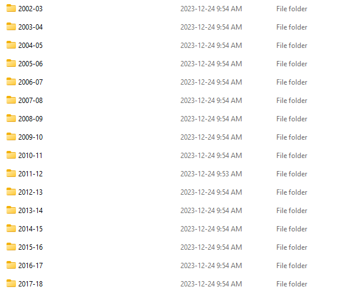
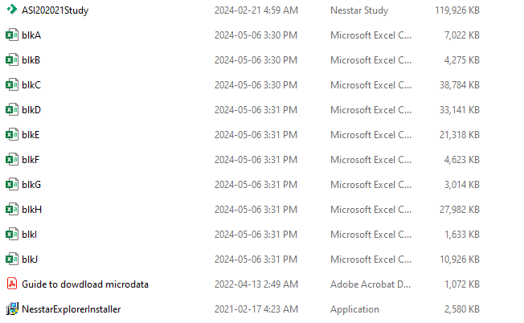

# ASI Cleaning Tutorial

This tutorial explains how to get the most detailed version of the Indian Survey of Industries (ASI) dataset.

It includes plant identifiers to track plants over time and district-level information for any plant that was observed at least once between 2007 and 2010.

### This tutorial allows you to access, clean, and merge two datasets:

1. The public version of the ASI (**Public ASI**), which *includes* district-level information but *excludes* plant identifiers.
2. The restricted version of the ASI (**Private ASI**), which *includes* plant identifiers but *exludes* district-level information.

# Table of contents

1. [Part A: Access and clean the Public ASI](#parta)
   - [Preliminaries](#preliminaries)

## Part A: Access and clean the Public ASI 

Upon performing this step, you will obtain a clean Stata dataset titled **ASI_Clean.dta**

### A.1 Preliminaries 

*For this part, you will need a windows computer.*

1. Head over to [https://www.microdata.gov.in/nada43/index.php/catalog/ASI](https://www.microdata.gov.in/nada43/index.php/catalog/ASI)
2. For each sample year, clic on the dataset for the corresponding sample year[^1].
3. Clic "GET MICRODATA"
   1. You will need to create an account and log-in. This will be very fast
4. You will now see a page that says **Application for Restricted Access Dataset**
   1. Under *Type of Dataset*, choose ASI
   2. Provide the intended use for the data (I usually write "research")
   3. clic *Submit*
5. Download and unzip the datafiles in a folder
6. As part of the extracted files, you will find an installer for Nesstar title *NesstarExploreInstaller*. Install the program. **You only need to do this once**
7. Open the .Nesstar dataset with Nesstar. The dataset is separated into blocks containing different sets of variables
   1. Block A: Identification
   2. Block B: Owner Details
   3. Block C: Fixed Assets
   4. Block D: Working Capital and Loans
   5. Block E: Employment and Labour Cost
   6. Block F: Other Expenses
   7. Block G: Other Ouputs/Receipts
   8. Block H: Inputs (Domestic)
   9. Block I: Inputs (Imported)
   10. Block J: Outputs Manufactured
8. In Nesstar, under "File", clic on "Export Dataset(s)..." and save all the blocks as .csv in a year-specific folder
9. Repeat 1-8 for each year you want data. If you want district-level information, make sure to include "2006-07" until "2009-10".
   1. Make sure that the block names are consistent across years. You should now have a folder that looks like that:

      |           All Years           | Single Year Example |
      | :-----------------------------: | :--------------------: |
      |  |  |

[^1]: For example, if you want data for 2021, clic on *Annual Survey of Industries 2020-21*
